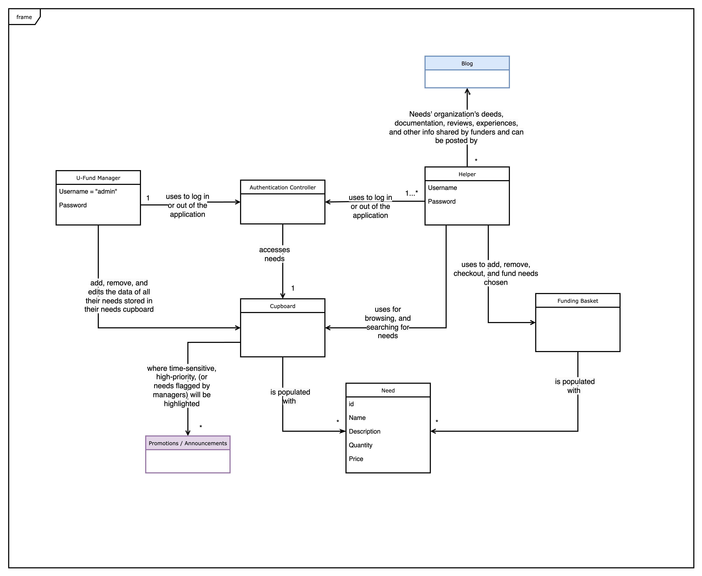
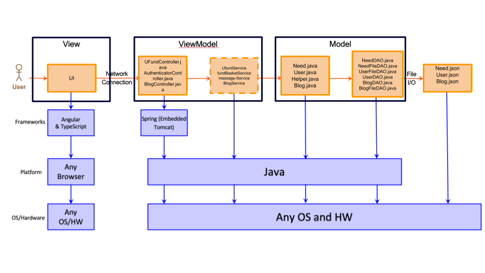
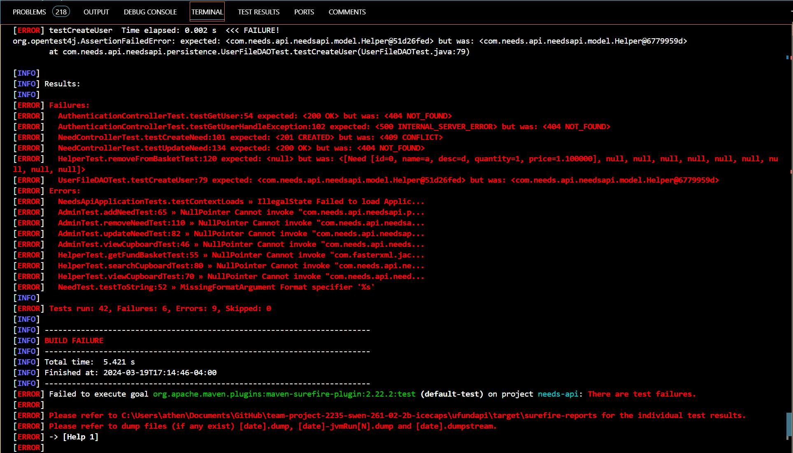

# PROJECT Design Documentation

> _The following template provides the headings for your Design
> Documentation.  As you edit each section make sure you remove these
> commentary 'blockquotes'; the lines that start with a > character
> and appear in the generated PDF in italics but do so only **after** all team members agree that the requirements for that section and current Sprint have been met. **Do not** delete future Sprint expectations._

## Team Information
* Team name: Ice Caps
* Team members
  * Logan Mui
  * Jolin Qiu
  * Zach Szelc
  * Aidan Henderson
  * Joven Symington

## Executive Summary

This is a summary of the project.

### Purpose
>  _**[Sprint 2 & 4]** Provide a very brief statement about the project and the most
> important user group and user goals._
Our project can be described as a "charity" website in which people who want to help and support organizations 
in "Need" of funding by donating to meet at companies goals. To add an organization to be funded you will need to be an admin. To support a companies needs you will neec to be a helper.

### Glossary and Acronyms
> _**[Sprint 2 & 4]** Provide a table of terms and acronyms._

| Term | Definition |
|------|------------|
| SPA | Single Page |
| HP | Home Page |
| FB | Fund Basket |
| MVP | Minimum Viable Product |
| AC | Acceptance Criteria|

## Requirements

This section describes the features of the application.

> _In this section you do not need to be exhaustive and list every
> story.  Focus on top-level features from the Vision document and
> maybe Epics and critical Stories._

### Definition of MVP
> _**[Sprint 2 & 4]** Provide a simple description of the Minimum Viable Product._
Our MVP must meet these requirements:
- A log-in page that you can sign in or register as an admin or helper
- The cupboard / HP should display the a list of needs and the respective functionality for admin and helper
- The funding basket must show a specific helpers needs they want to support and they can either checkout or delete the needs in their funding basket
- The data in a helpers personal funding bakset and global cupboard must persist

### MVP Features
>  _**[Sprint 4]** Provide a list of top-level Epics and/or Stories of the MVP._

### Enhancements
> _**[Sprint 4]** Describe what enhancements you have implemented for the project._

## Application Domain

This section describes the application domain.

> _**[Sprint 2 & 4]** Provide a high-level overview of the domain for this application. You
> can discuss the more important domain entities and their relationship
> to each other._

The Domain of the application:
-The Cupboard stores a series of needs in itself.
-The Authentication Controller begins by determining the validity of the Username and Password of the user attempting to sign in, and routes them to their respective page. They may also log out of their account.
-The U-Fund Manager is able to add, remove, search and edit Needs in the Cupboard.
-The Helper is able to search needs from the cupboard, and then add/remove the needs to their Funding Basket and checkout with their needs.
-The Funding Basket is able to store a series of Needs
-The Promotions are shown in the Cupboard, and will appear to all Users.

## Architecture and Design

This section describes the application architecture.

### Summary

The following Tiers/Layers model shows a high-level view of the webapp's architecture. 
**NOTE**: detailed diagrams are required in later sections of this document.
> _**[Sprint 1]** (Augment this diagram with your **own** rendition and representations of sample system classes, placing them into the appropriate M/V/VM (orange rectangle) tier section. Focus on what is currently required to support **Sprint 1 - Demo requirements**. Make sure to describe your design choices in the corresponding _**Tier Section**_ and also in the _**OO Design Principles**_ section below.)_

The web application, is built using the Model–View–ViewModel (MVVM) architecture pattern. 

The Model stores the application data objects including any functionality to provide persistance. 

The View is the client-side SPA built with Angular utilizing HTML, CSS and TypeScript. The ViewModel provides RESTful APIs to the client (View) as well as any logic required to manipulate the data objects from the Model.

Both the ViewModel and Model are built using Java and Spring Framework. Details of the components within these tiers are supplied below.

### Overview of User Interface

This section describes the web interface flow; this is how the user views and interacts with the web application.

> _Provide a summary of the application's user interface.  Describe, from the user's perspective, the flow of the pages in the web application._

-> (means "Navigate to")
| (means "or it can navigate to")

LoginPage: 
Shows fields to login via Username and password, also shows a way to register for an account
Navigation:
LoginPage -> RegisterPage | -> AdminPage(Admin login), HelperPage(Helper login)

Register:
Shows fields to register for an account.
Navigation:
Register -> LoginPage

AdminPage:
Displays a way to add Needs, Search for needs, displays the cupboard and a link to edit needs, and sign out of the admin account
Navigation:
AdminPage -> LoginPage | -> NeedDetail

NeedDetail:
Displays a button to navigate to the admin page and fields to edit the need selected and save it or delete the need selected
Navigation:
NeedDetail -> AdminPage

HelperPage:
The helper page displays a way to search for needs, the cupboard that is populated with needs, and a way to sign out of the helper account.
Navigation:
HelperPage -> LoginPage | -> FundBasket

FundBasket:
Shows the needs in your funding basket and a way to checkout your funding basket.
Navigation:
FundBasket -> HelperPage

### View Tier
> _**[Sprint 4]** Provide a summary of the View Tier UI of your architecture.
> Describe the types of components in the tier and describe their
> responsibilities.  This should be a narrative description, i.e. it has
> a flow or "story line" that the reader can follow._

> _**[Sprint 4]** You must  provide at least **2 sequence diagrams** as is relevant to a particular aspects 
> of the design that you are describing.  (**For example**, in a shopping experience application you might create a 
> sequence diagram of a customer searching for an item and adding to their cart.)
> As these can span multiple tiers, be sure to include an relevant HTTP requests from the client-side to the server-side 
> to help illustrate the end-to-end flow._

> _**[Sprint 4]** To adequately show your system, you will need to present the **class diagrams** where relevant in your design. Some additional tips:_
 >* _Class diagrams only apply to the **ViewModel** and **Model** Tier_
>* _A single class diagram of the entire system will not be effective. You may start with one, but will be need to break it down into smaller sections to account for requirements of each of the Tier static models below._
 >* _Correct labeling of relationships with proper notation for the relationship type, multiplicities, and navigation information will be important._
 >* _Include other details such as attributes and method signatures that you think are needed to support the level of detail in your discussion._

### ViewModel Tier
> _**[Sprint 1]** List the classes supporting this tier and provide a description of there purpose._
  
  UFundController: Responsible for dealing with cURL command using REST CRUD methods.s
  AuthenticationController: Deals with the authentication Crud commands
  BlogController: Deals with the Blog Crud commands

> _**[Sprint 4]** Provide a summary of this tier of your architecture. This
> section will follow the same instructions that are given for the View
> Tier above._

> _At appropriate places as part of this narrative provide **one** or more updated and **properly labeled**
> static models (UML class diagrams) with some details such as critical attributes and methods._
> 

### Model Tier
> _**[Sprint 1]** List the classes supporting this tier and provide a description of there purpose._

Model: Need.java - The representation of a need with some need functionality. Our needs contain an id, name, description, quantity, and price.

User.java - The representation of a user as in interface.

Helper.java - The typical user/customer for our application which is composed of a username, password, and FB which holds a need and their personal quantity associated with those needs.
Post.Java - The model of a typical blog post which has a User attached to it and a description, number of likes, and the list of users that have liked the post

Persistence: NeedFileDAO.java - Contains a list of needs and functions associated with this list of needs.
  NeedDAO.java - An interface that can be associated with any classes similar to a Cupboard.
  UserFileDAO - Contains the list of users that has a username, password, and a funding basket.
  UserDAO - An interface that can be associated with any classes similar to a Users.
  BlogFileDAO - Contains a list of blogs and functions associated with this list of blogs.
  BlogDAO - An interface that can be associated with any classes similar to a Blogs.
  

> _**[Sprint 2, 3 & 4]** Provide a summary of this tier of your architecture. This
> section will follow the same instructions that are given for the View
> Tier above._

> _At appropriate places as part of this narrative provide **one** or more updated and **properly labeled**
> static models (UML class diagrams) with some details such as critical attributes and methods._
> 

## OO Design Principles

> _**[Sprint 1]** Name and describe the initial OO Principles that your team has considered in support of your design (and implementation) for this first Sprint._

Single Responsibility - Most of the classes had one specific purpose.
Injection - The logger was injected into the UFundController. The Object mapper is injected into the NeedFileDAO.
Low Coupling - Most of our classes relyed on little to no other classes lowering our dependacies and made them easier to understand.
Law of Demeter - Typically in our system the classes can only communicate with particular clases ie. only services can speak to the controller on our backend.
Pure Fabrication - This is in line with our low coupling and single responsibility. A good way to emphasize this is our needoftheweek component in our frontend. 
Instead of implementing this on our need-detail component it has its own separate component.

> _**[Sprint 2, 3 & 4]** Will eventually address upto **4 key OO Principles** in your final design. Follow guidance in augmenting those completed in previous Sprints as indicated to you by instructor. Be sure to include any diagrams (or clearly refer to ones elsewhere in your Tier sections above) to support your claims._

> _**[Sprint 3 & 4]** OO Design Principles should span across **all tiers.**_

## Static Code Analysis/Future Design Improvements
> _**[Sprint 4]** With the results from the Static Code Analysis exercise, 
> **Identify 3-4** areas within your code that have been flagged by the Static Code 
> Analysis Tool (SonarQube) and provide your analysis and recommendations.  
> Include any relevant screenshot(s) with each area._

> _**[Sprint 4]** Discuss **future** refactoring and other design improvements your team would explore if the team had additional time._

## Testing
> _This section will provide information about the testing performed
> and the results of the testing._

### Acceptance Testing
> _**[Sprint 2 & 4]** Report on the number of user stories that have passed all their
> acceptance criteria tests, the number that have some acceptance
> criteria tests failing, and the number of user stories that
> have not had any testing yet. Highlight the issues found during
> acceptance testing and if there are any concerns._

Passed:
  - Admin 
  - Authentication
  - (N/A)

Failed:
  - Helper:
      AC: 
        - Quantity persistance is having issues
        - Checkout hasn't been checked off due to FB persistance
        - Remove function doesn't remove consistantly.
  - (N/A)

Not Tested:
  - (N/A)

### Unit Testing and Code Coverage
> _**[Sprint 4]** Discuss your unit testing strategy. Report on the code coverage
> achieved from unit testing of the code base. Discuss the team's
> coverage targets, why you selected those values, and how well your
> code coverage met your targets._

>_**[Sprint 2 & 4]** **Include images of your code coverage report.** If there are any anomalies, discuss
> those._

 

## Ongoing Rationale
>_**[Sprint 1, 2, 3 & 4]** Throughout the project, provide a time stamp **(yyyy/mm/dd): Sprint # and description** of any _**mayor**_ team decisions or design milestones/changes and corresponding justification._

(2/20/2024): Sprint 1 - During this sprint our group got some specific roles and created a demo for our customer to show off our progress. 
(3/19/2024): Sprint 2 - This sprint pushed us into the Construction stage where we had to create our MVP for our customer. We as a team split up our resposibilities and had to work together to fix some team issues that came up.
(4/4/2024): Sprint 3 - This sprint is a continuation of the Construction stage where we fixed some bugs and implemented our 10% enhancements. A major decision that we had made is that the cupboard when fufilled will display as the amount it is "excess", and a string indicating that the goal has already been met. In the edit function for the Needs (viewable by admin), the actual number is displayed as negative. This is because the need is past it's "needed quantity", hence it is overflow. It was decided to make it so that the edit function still would only take positive numbers as the quantity, as we felt that moving the goal post of the excess is not useful. To remove the excess tag, simply set the quantity to something greater than 0.
